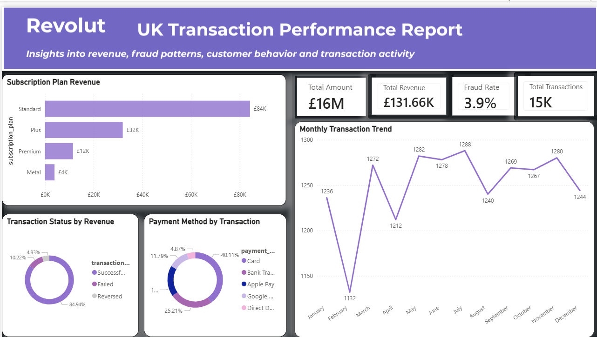
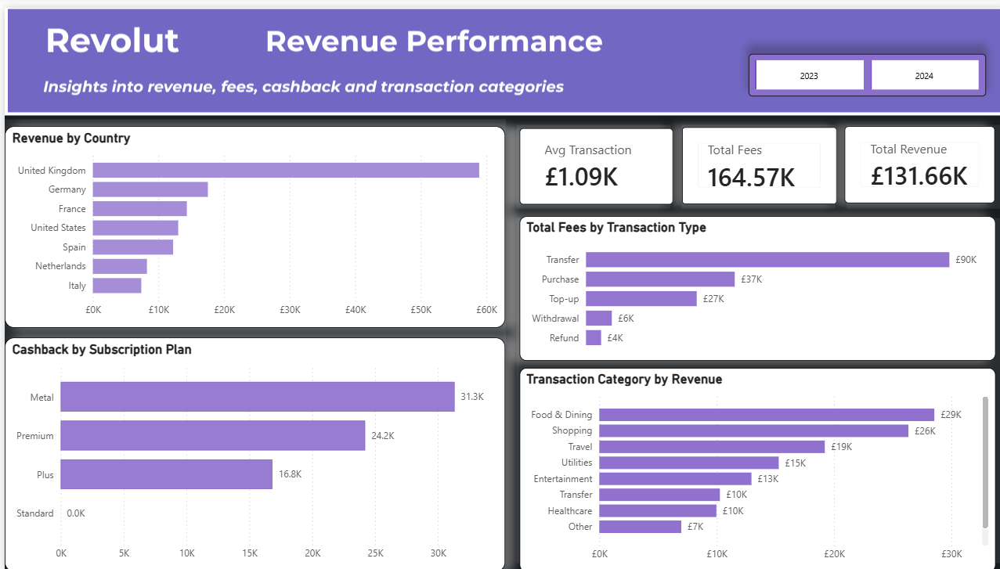
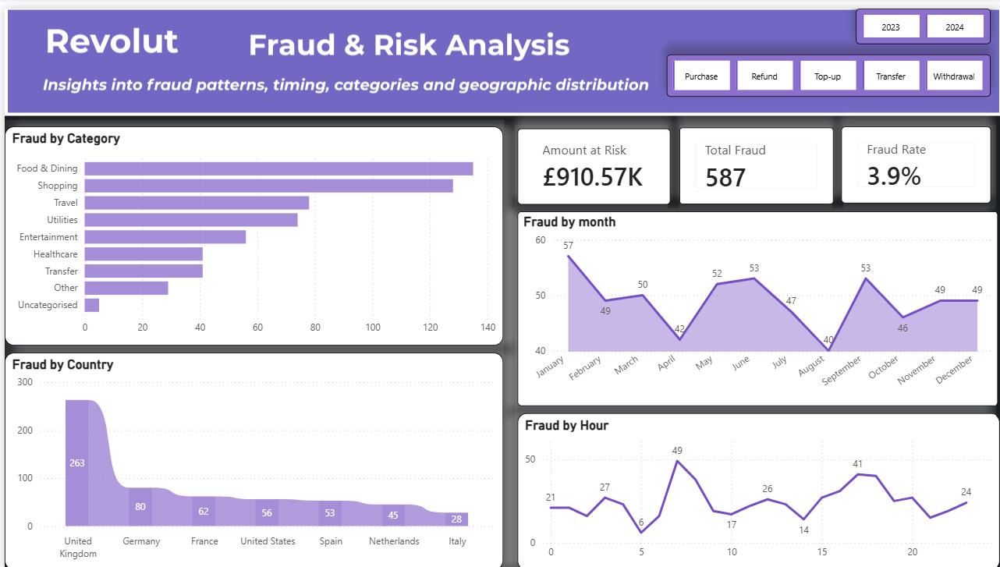
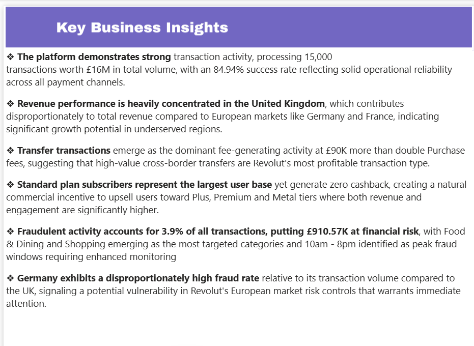
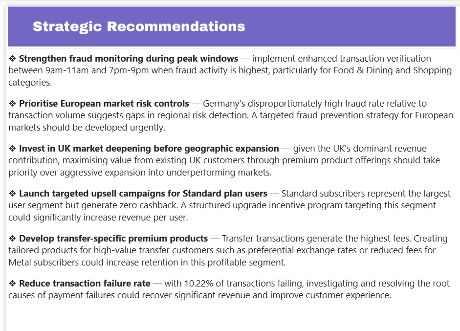

# 🇬🇧 UK Fintech Transaction Performance Dashboard



## 📌 Project Overview
This project simulates and analyses 15,000 UK-based financial transactions 
inspired by Revolut's digital banking platform. Using Python for data 
generation and cleaning, and Power BI for interactive visualisation, the 
dashboard uncovers insights into revenue performance, fraud patterns, 
customer behaviour and transaction activity across 2023–2024.
## 🎯 Problem Statement
The analysis was designed to answer the following business questions:
- Which subscription plans generate the most revenue?
- What are the monthly transaction trends across 2023–2024?
- Which transaction categories are most prone to fraud?
- Which countries have disproportionately high fraud rates?
- What are the peak fraud hours requiring enhanced monitoring?
- How do payment methods distribute across transactions?

## 🛠️ Tools & Technologies
| Tool | Purpose |
|------|---------|
| Python (Pandas, NumPy) | Data simulation and cleaning |
| Matplotlib & Seaborn | Exploratory data analysis |
| Power BI | Interactive dashboard development |
| DAX | Calculated measures and KPIs |
| GitHub | Version control and documentation |

## 📁 Project Structure
```
uk-fintech-transaction-dashboard/
├── data/ → Raw and cleaned datasets
├── notebooks/ → Python notebooks for cleaning and EDA
├── dashboard/ → Power BI .pbix file
├── images/ → Dashboard screenshots
└── README.md
```
## 📊 Dashboard Pages

### 1. Home — Transaction Overview


### 2. Revenue Performance


### 3. Fraud & Risk Analysis


### 4. Key Business Insights


### 5. Strategic Recommendations

